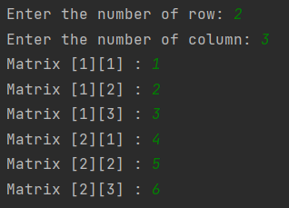
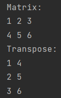

# Matrix Transpose

### This program presents the transpose of a matrix.

---

## Details
* The program takes row and column numbers and elements from the user.
* It prints matrix taken from the user and the matrix's transpose.
* The input will be as: 

* The output will be as: 

---

## Installation
Clone the project.
> https://github.com/miyendisa/matrix-transpose.git

---

## Usage
After cloning the project, open it with the ide you used.

---

## Requirements
* JDK (version 19 is recommended)

---

## Author
**Aslıhan Hasar**

* GitHub: [miyendisa](https://github.com/miyendisa)
* LinkedIn: [aslıhanhasar](https://www.linkedin.com/in/asl%C4%B1hanhasar
  )
---

## Contributing
Contributions, issues, and feature requests are welcome.

---

## License

[MIT](https://choosealicense.com/licenses/mit/)

---

## Show Your Suport
Give me a &#11088; if you like the project.

---

## Acknowledgments
* This repo is created for my homeworks on www.patika.dev.